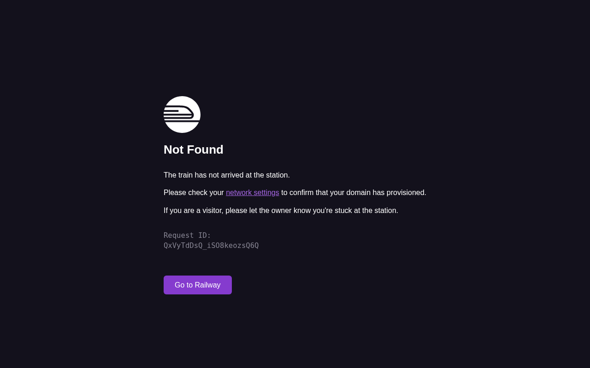

# Verification Report

**Run ID**: `verify-20251225-190748`
**Started**: 2025-12-25T19:07:48.025551
**Completed**: 2025-12-25T19:07:58.676171
**Base URL**: https://affordabot.up.railway.app

---

## Summary

| Metric | Value |
|--------|-------|
| Total Stories | 12 |
| Passed | 12 |
| Failed | 0 |
| Skipped | 0 |
| Success Rate | 100.0% |
| LLM Calls | 1 |

---

## Affordabot RAG Pipeline

### rag_00_env ✅

**Environment Check**

- Status: passed
- Duration: 0.00s
- LLM Calls: 0

### rag_01_discovery ✅

**Discovery: LLM Query Generation**

- Status: passed
- Duration: 0.00s
- LLM Calls: 0

### rag_02_search ✅

**Search: Z.ai Web Search**

- Status: passed
- Duration: 0.00s
- LLM Calls: 0

### rag_03_ingest ✅

**Ingestion: Chunk Creation**

- Status: passed
- Duration: 0.00s
- LLM Calls: 0

### rag_04_embed ✅

**Embedding: OpenRouter**

- Status: passed
- Duration: 0.00s
- LLM Calls: 0

### rag_05_vector ✅

**Vector Store: PgVector Insert**

- Status: passed
- Duration: 0.00s
- LLM Calls: 0

### rag_06_retrieve ✅

**Retrieval: Similarity Search**

- Status: passed
- Duration: 0.00s
- LLM Calls: 0

### rag_07_research ✅

**Research: LLM Research Step**

- Status: passed
- Duration: 0.00s
- LLM Calls: 0

### rag_08_generate ✅

**Generate: Cost Analysis**

- Status: passed
- Duration: 0.00s
- LLM Calls: 0

### rag_09_review ✅

**Review: Critique Step**

- Status: passed
- Duration: 0.00s
- LLM Calls: 0

### rag_10_refine ✅

**Refine: Final Polish**

- Status: passed
- Duration: 0.00s
- LLM Calls: 0

### rag_11_admin ✅

**Admin UI: Visual Validation**

- Status: passed
- Duration: 10.21s
- LLM Calls: 1



**GLM-4.6V Analysis**:
```

This screenshot displays a **railway-themed error page** (likely a 404 or "Not Found" status) with a dark background. Here’s a breakdown of its components:  


### 1. Main Sections & Content  
- **Logo/Icon**: A circular icon (resembling a train or railway symbol) at the top, reinforcing the "railway" theme.  
- **Error Heading**: Bold text reading *"Not Found"* (white, centered).  
- **Explanatory Text**:  
  - Primary message: *"The train has not arrived at the station."* (white, smaller font
```
